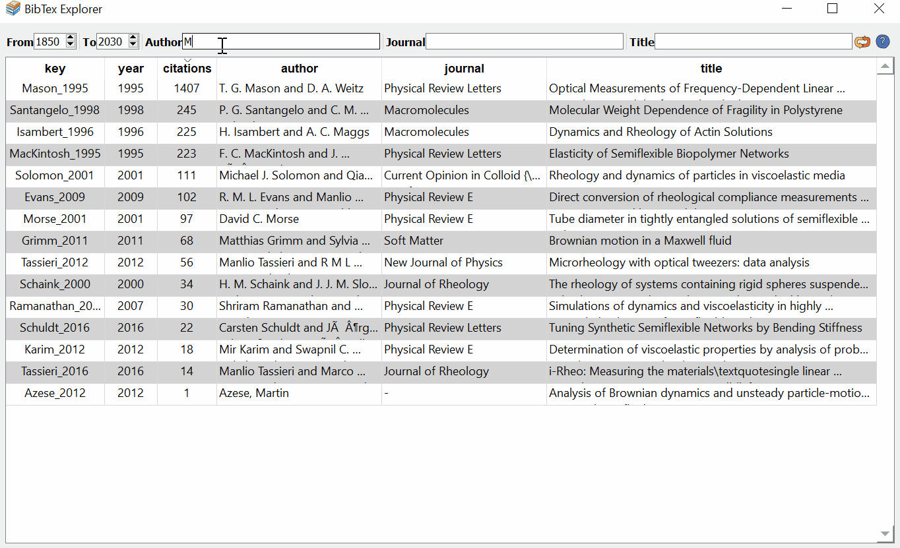

# BibTexExplorer

Simple but effective tool to view/search bibtex files.

Just run:

``python -m BibTexExplorer FILE.bib``

and you will have a quick view of the contents of your BibTex file.

   - Sort entries by clicking on the column headers.
   - Filter entries by entering a date range or some words in the author, journal and title fields.
   - Press Ctrl-R to clear filters
   - Double-click on a key to open the PDF (if a PDf with the same name as the key exists in the same folder as your bib file).
   - Right-click on an entry to copy the BibTex code.

By default, the app shows my favorite fields **key**, **year**, **citations** (which I grab from Google Scholar and include them in my BibTex files), **author**, **journal** and **title**. If you want to show other fields, just edit the code to your needs (BibTexExplorer.TableWidget.populate and other functions within the TableWidget file).

&copy; Jorge Ramirez UPM, 2020
